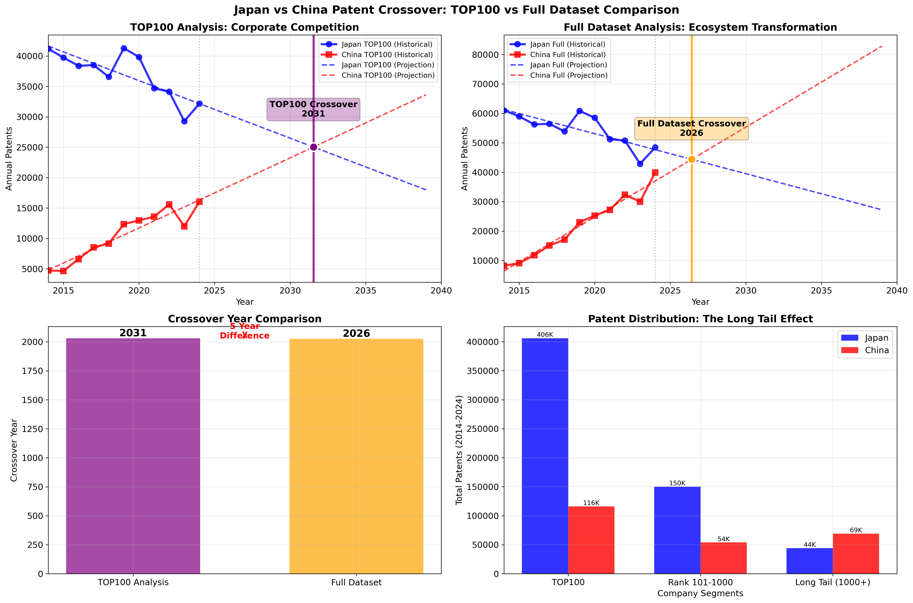

# The Long Tail Effect: Why China Overtakes Japan 5 Years Earlier

## Executive Summary

Our analysis reveals a striking 5-year difference in patent crossover predictions between Japan and China depending on the dataset used:

- **TOP100 Analysis**: China overtakes Japan in **2031** (~25,000 patents each)
- **Full Dataset Analysis**: China overtakes Japan in **2026** (~44,390 patents each)

This report explains the "Long Tail" effect that creates this dramatic difference and its implications for understanding global innovation competition.



---

## 📚 What is the "Long Tail"?

The **Long Tail** is a statistical concept describing how:
- A **few big players** (the "Head") appear to dominate
- **Many small players** (the "Tail") collectively matter more than expected

**Visual analogy**: Think of a dinosaur - big head, very long tail!

In patent analysis:
- **Head** = TOP100 companies (major corporations)
- **Tail** = Thousands of smaller companies, universities, research institutes

---

## 🏢 JP vs CN Patent Ecosystem Structure

### Japan: "Innovation Aristocracy" 🎩
```
📊 Patent Market(#patent) Structure: CONCENTRATED
┌─────────────────────────────────────────┐
│ TOP100: 405,795 patents (67.7%)        │ ← THE HEAD (dominant)
│ Long Tail: 193,573 patents (32.3%)     │ ← THE TAIL (smaller)
└─────────────────────────────────────────┘
```
- **14,418 total companies**
- Big companies dominate innovation
- Traditional "zaibatsu" model
- Excellence concentrated at the top

### China: "Innovation Democracy" 🌊
```
📊 Patent Market(#patent) Structure: DISTRIBUTED  
┌─────────────────────────────────────────┐
│ TOP100: 116,224 patents (48.6%)        │ ← THE HEAD (important but...)
│ Long Tail: 122,855 patents (51.4%)     │ ← THE TAIL (MASSIVE!)
└─────────────────────────────────────────┘
```
- **32,104 total companies**  
- Long Tail is BIGGER than the Head!
- Mass participation model
- Innovation distributed across ecosystem

---

## ⚡ The Numbers That Tell the Story

| Segment | Japan Patents | China Patents | JP:CN Ratio | Insight |
|---------|---------------|---------------|-------------|---------|
| **TOP100** | 405,795 | 116,224 | **3.5:1** | Japan dominates |
| **Long Tail** | 193,573 | 122,855 | **1.6:1** | Much closer! |
| **Total** | 599,368 | 239,079 | **2.5:1** | Gap narrowing |

### Growth Rate Dynamics

**Japan's Challenge:**
- TOP100 declining slowly (-946 patents/year)
- Long Tail declining faster (SMEs struggling)
- **Entire patent ecosystem shrinking**

**China's Strategy:**
- TOP100 growing moderately (+1,153 patents/year)
- Long Tail **EXPLODING** (universities, startups, regional companies)
- **Patent ecosystem expansion at every level**

---

## 🎯 The 5-Year Difference Explained

### TOP100 Analysis (2031 Crossover): Corporate Competition

```
Scenario: Japan's Giants vs China's Giants
├─ Japan: Canon, Toyota, Sony (strong but declining)
├─ China: Huawei, BOE, Tencent (growing but fewer)  
└─ Result: Takes until 2031 for China's big companies 
           to catch Japan's big companies
```

**Characteristics:**
- Focuses on established market leaders
- Traditional corporate rivalry
- Quality vs Scale competition
- Slower crossover due to Japan's concentrated excellence

### Full Dataset Analysis (2026 Crossover): Ecosystem Transformation

```
Scenario: Japan's System vs China's System
├─ Japan: 14,418 companies total (concentrated at top)
├─ China: 32,104 companies total (distributed power)
└─ Result: China's massive Long Tail accelerates 
           crossover to 2026
```

**Characteristics:**
- Captures entire innovation infrastructure
- Mass participation vs Elite concentration
- Distributed innovation vs Centralized excellence  
- Faster crossover due to China's ecosystem breadth

---

## 🔍 The Long Tail Components

### China's Long Tail Includes:
- **Universities**: Massive government push for academic patents
- **Research Institutes**: State-funded R&D expansion  
- **Regional Companies**: Provincial innovation hubs
- **Startups**: Entrepreneurial ecosystem boom
- **SOEs**: State-owned enterprises at all levels
- **Joint Ventures**: International collaboration

### Japan's Long Tail:
- **SMEs**: Traditional small/medium enterprises (declining)
- **Universities**: Limited patent focus (cultural difference)
- **Regional Companies**: Fewer, more specialized
- **Subsidiaries**: Of large corporations (counted separately)

---

## 📊 Crossover Timeline Analysis

```
PATENT CROSSOVER SCENARIOS:

2024: JP leads CN by large margin
      │
      ├─ TOP100 Analysis Path:
      │  • Japan's big companies decline slowly
      │  • China's big companies grow moderately  
      │  • Corporate competition timeline
      │  • Crossover: 2031 (~25K patents each)
      │
      └─ Full Dataset Analysis Path:
         • Japan's entire ecosystem declines
         • China's Long Tail explodes
         • Long Tail effect accelerates crossover
         • Ecosystem transformation timeline
         • Crossover: 2026 (~44K patents each)
```

### Key Crossover Metrics

| Analysis Type | Crossover Year | Patents at Crossover | Japan's Lead (2024) | Patent Gap Closure Rate |
|---------------|----------------|---------------------|---------------------|------------------------|
| **TOP100** | 2031 | ~25,000 | ~16,000 patents | ~2,100 patents/year |
| **Full Dataset** | 2026 | ~44,390 | ~8,500 patents | ~4,400 patents/year |

---

## 🎖️ Strategic Implications

### Two Different Competitions

1. **Corporate Competition** (TOP100): 
   - **Nature**: Japan's industrial giants vs China's tech giants
   - **Timeline**: 2031
   - **Focus**: Quality vs Scale corporate rivalry
   - **Relevance**: Industry analysis, M&A, corporate strategy

2. **National Innovation Capacity** (Full Dataset):
   - **Nature**: Entire innovation ecosystems
   - **Timeline**: 2026  
   - **Focus**: Concentrated excellence vs Distributed participation
   - **Relevance**: Government policy, economic planning, national competitiveness

### Innovation Philosophy Differences

**Japan's "Innovation Aristocracy":**
- Excellence concentrated in established giants
- High-quality, high-value patents
- Efficiency-focused innovation
- Strategic consolidation approach

**China's "Innovation Democracy":**
- Mass participation across ecosystem levels
- Volume-driven patent expansion
- Scale-focused innovation  
- Ecosystem expansion approach

---

## 🔮 Future Implications

### If Current Trends Continue:

**By 2030:**
- **Corporate Level**: Japan's giants still competitive
- **Patent Ecosystem Level**: China's distributed innovation dominant
- **Global Impact**: Two different innovation models coexisting

**Strategic Considerations:**
- Japan should leverage quality advantages while expanding ecosystem participation
- China should balance growth with patent quality and commercial viability
- Both nations offer complementary strengths for international collaboration

---

## 📈 The Long Tail Lesson

The Long Tail analysis reveals that **China's competitive advantage comes from BREADTH, not just DEPTH:**

- **Japan**: Deeper expertise (higher patent count per company)
- **China**: Broader participation (more patent-filing companies participating)

**The 2026 crossover represents China achieving "patent democracy" - thousands of smaller players collectively outproducing Japan's concentrated patent excellence.**

This explains why China can overtake Japan in **total patent output** (2026) before overtaking in **major corporate patent competition** (2031). It's the difference between **patent ecosystem transformation** vs **corporate patent competition**.

---

## 🎯 Key Takeaways

1. **The Long Tail Matters**: Small patent filers collectively create massive impact
2. **Different Datasets Tell Different Stories**: Choose analysis scope based on objectives
3. **Patent Strategies Differ**: Concentration vs Distribution approaches
4. **Timing Varies by Perspective**: Corporate patent competition (2031) vs National patent capacity (2026) crossover
5. **Both Forecasts Are Valid**: For different purposes and audiences

The Long Tail effect demonstrates that in global patent competition, **ecosystem breadth can be just as important as corporate depth**.

---

*Analysis based on patent issuance data from Japanese (14,418 companies) and Chinese (32,104 companies) complete datasets, compared with TOP100 analysis (100 companies each).*

**Generated**: 2024-08-10 (Analysis Date)
