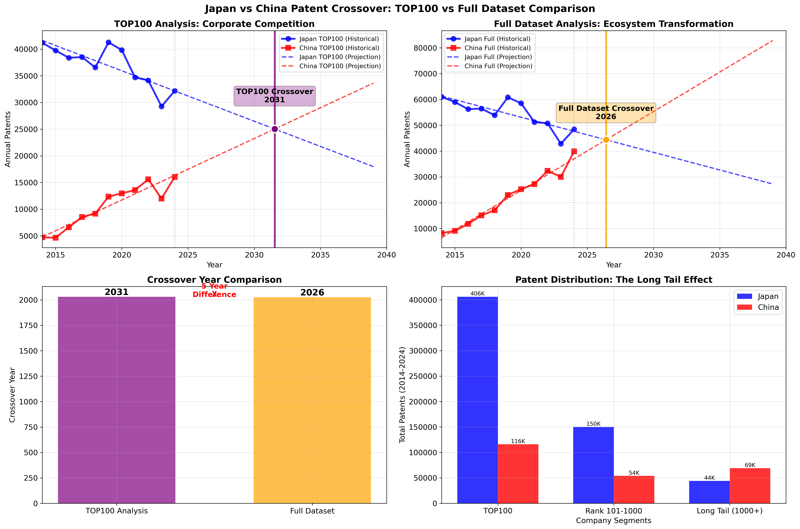

# ロングテール効果：中国が日本を5年早く追い越す理由

## エグゼクティブサマリー

私たちの分析では、使用するデータセットによって日中の特許クロスオーバー予測に5年の大きな差があることが明らかになりました：

- **TOP100分析**: 中国は**2031年**に日本を追い越す（各国約25,000件の特許）
- **全データセット分析**: 中国は**2026年**に日本を追い越す（各国約44,390件の特許）

本レポートでは、この劇的な差を生み出す「ロングテール」効果と、グローバルな特許競争を理解するための含意について説明します。



---

## 📚 「ロングテール」とは何か？

**ロングテール**は、以下のような統計概念です：
- **少数の大企業**（「ヘッド」）が支配的に見える
- **多数の小企業**（「テール」）が集合的に予想以上に重要

**視覚的な比喩**：恐竜を想像してください - 大きな頭、とても長い尻尾！

特許分析では：
- **ヘッド** = TOP100企業（主要企業）
- **テール** = 数千の中小企業、大学、研究機関

---

## 🏢 日中特許エコシステム構造比較

### 日本：「特許貴族制」🎩
```
📊 特許市場(#特許)構造: 集中型
┌─────────────────────────────────────────┐
│ TOP100: 405,795件特許 (67.7%)           │ ← ヘッド（支配的）
│ ロングテール: 193,573件特許 (32.3%)      │ ← テール（より小規模）
└─────────────────────────────────────────┘
```
- **合計14,418社**
- 大企業が特許を支配
- 伝統的な「財閥」モデル
- トップに集中した卓越性

### 中国：「特許民主制」🌊
```
📊 特許市場(#特許)構造: 分散型
┌─────────────────────────────────────────┐
│ TOP100: 116,224件特許 (48.6%)           │ ← ヘッド（重要だが...）
│ ロングテール: 122,855件特許 (51.4%)      │ ← テール（巨大！）
└─────────────────────────────────────────┘
```
- **合計32,104社**
- ロングテールがヘッドより大きい！
- 大衆参加モデル
- エコシステム全体に分散された特許

---

## ⚡ 物語を語る数字

| セグメント | 日本特許数 | 中国特許数 | 日:中比率 | 洞察 |
|-----------|-----------|-----------|---------|-----|
| **TOP100** | 405,795 | 116,224 | **3.5:1** | 日本が支配 |
| **ロングテール** | 193,573 | 122,855 | **1.6:1** | はるかに接近！ |
| **合計** | 599,368 | 239,079 | **2.5:1** | ギャップ縮小 |

### 成長率の動向

**日本の課題:**
- TOP100が緩やかに減少（年間-946件）
- ロングテールがより急速に減少（中小企業の苦戦）
- **特許エコシステム全体が縮小**

**中国の戦略:**
- TOP100が適度に成長（年間+1,153件）
- ロングテールが**爆発的成長**（大学、スタートアップ、地方企業）
- **あらゆるレベルでの特許エコシステム拡大**

---

## 🎯 5年の差の説明

### TOP100分析（2031年クロスオーバー）：企業競争

```
シナリオ: 日本の巨人企業 vs 中国の巨人企業
├─ 日本: キヤノン、トヨタ、ソニー（強いが減少）
├─ 中国: ファーウェイ、BOE、テンセント（成長しているがより少数）
└─ 結果: 中国の大企業が日本の大企業に追いつくまで
          2031年まで要する
```

**特徴:**
- 確立された市場リーダーに焦点
- 伝統的な企業競争
- 品質 vs スケール競争
- 日本の集中した卓越性により遅いクロスオーバー

### 全データセット分析（2026年クロスオーバー）：エコシステム変革

```
シナリオ: 日本のシステム vs 中国のシステム
├─ 日本: 合計14,418社（トップに集中）
├─ 中国: 合計32,104社（分散した力）
└─ 結果: 中国の巨大なロングテールが
          2026年へのクロスオーバーを加速
```

**特徴:**
- 全特許インフラを把握
- 大衆参加 vs エリート集中
- 分散特許 vs 集中卓越性
- 中国のエコシステムの幅により速いクロスオーバー

---

## 🔍 ロングテールの構成要素

### 中国のロングテールに含まれるもの:
- **大学**: 学術特許への大規模な政府支援
- **研究機関**: 国家資金によるR&D拡大
- **地方企業**: 省レベルの特許ハブ
- **スタートアップ**: 起業エコシステムブーム
- **国有企業**: あらゆるレベルの国有企業
- **合弁事業**: 国際協力

### 日本のロングテール:
- **中小企業**: 伝統的な中小企業（減少）
- **大学**: 限定的な特許重点（文化的違い）
- **地方企業**: より少数、より専門化
- **子会社**: 大企業の（別途カウント）

---

## 📊 クロスオーバータイムライン分析

```
特許クロスオーバーシナリオ:

2024年: 日本が中国を大幅にリード
      │
      ├─ TOP100分析パス:
      │  • 日本の大企業がゆっくり減少
      │  • 中国の大企業が適度に成長
      │  • 企業競争タイムライン
      │  • クロスオーバー: 2031年（各約25K件）
      │
      └─ 全データセット分析パス:
         • 日本の全エコシステムが減少
         • 中国のロングテールが爆発
         • ロングテール効果がクロスオーバーを加速
         • エコシステム変革タイムライン
         • クロスオーバー: 2026年（各約44K件）
```

### 主要クロスオーバー指標

| 分析タイプ | クロスオーバー年 | クロスオーバー時特許数 | 日本のリード（2024年） | 特許ギャップ縮小率 |
|-----------|-----------------|---------------------|---------------------|------------------|
| **TOP100** | 2031 | ~25,000 | ~16,000件 | ~年間2,100件 |
| **全データセット** | 2026 | ~44,390 | ~8,500件 | ~年間4,400件 |

---

## 🎖️ 戦略的含意

### 2つの異なる競争

1. **企業競争**（TOP100）：
   - **性質**: 日本の産業巨人 vs 中国の技術巨人
   - **タイムライン**: 2031年
   - **焦点**: 品質 vs スケール企業競争
   - **関連性**: 業界分析、M&A、企業戦略

2. **国家特許能力**（全データセット）：
   - **性質**: 全特許エコシステム
   - **タイムライン**: 2026年
   - **焦点**: 集中卓越性 vs 分散参加
   - **関連性**: 政府政策、経済計画、国家競争力

### 特許戦略の哲学的違い

**日本の「特許貴族制」:**
- 確立された巨人に集中した卓越性
- 高品質、高価値特許
- 効率重視の特許戦略
- 戦略的統合アプローチ

**中国の「特許民主制」:**
- エコシステム レベル全体での大衆参加
- ボリューム重視の特許拡大
- スケール重視の特許戦略
- エコシステム拡大アプローチ

---

## 🔮 将来への含意

### 現在の傾向が続く場合:

**2030年まで:**
- **企業レベル**: 日本の巨人はまだ競争力がある
- **特許エコシステム レベル**: 中国の分散特許が支配的
- **グローバルな影響**: 2つの異なる特許モデルが共存

**戦略的考慮事項:**
- 日本は品質の優位性を活用しながらエコシステム参加を拡大すべき
- 中国は成長と特許品質および商業的実行可能性のバランスを取るべき
- 両国は国際協力のための補完的強みを提供

---

## 📈 ロングテールの教訓

ロングテール分析は、**中国の競争優位が深さだけでなく幅から来ている**ことを明らかにします：

- **日本**: より深い専門知識（企業あたりのより多い特許数）
- **中国**: より広い参加（より多くの特許出願企業が参加）

**2026年のクロスオーバーは、中国が「特許民主制」を達成することを表しています - 数千の小規模プレーヤーが集合的に日本の集中した特許卓越性を上回る。**

これは、なぜ中国が**主要企業特許競争**（2031年）で追い越す前に**総特許出力**（2026年）で日本を追い越すことができるのかを説明します。これは**特許エコシステム変革** vs **企業特許競争**の違いです。

---

## 🎯 主要な要点

1. **ロングテールは重要**: 小規模特許出願者が集合的に大きな影響を創出
2. **異なるデータセットは異なる物語を語る**: 目的に基づいて分析範囲を選択
3. **特許戦略は異なる**: 集中 vs 分散アプローチ
4. **タイミングは視点によって変わる**: 企業特許競争（2031年） vs 国家特許能力（2026年）クロスオーバー
5. **両方の予測は有効**: 異なる目的と聴衆のため

ロングテール効果は、グローバル特許競争において、**エコシステムの幅が企業の深さと同じくらい重要である**ことを実証しています。

---

*日本（14,418社）および中国（32,104社）の完全データセットからの特許発行データに基づく分析。TOP100分析（各100社）と比較。*

**生成日**: 2024-08-10（分析日）

---

## 📊 補足データ

### データソース
- **日本全データセット**: JP_AN_issue_year_ROOT_st.csv（14,746社）
- **中国全データセット**: CN_AN_issue_year_ROOT_st.csv（35,073社）
- **日本TOP100**: JP_TOP100_AN_issue_year_ROOT_st.xlsx（100社）
- **中国TOP100**: CN_TOP100_AN_issue_year_ROOT_st.xlsx（100社）

### 分析期間
- **対象期間**: 2014年-2024年（11年間）
- **予測期間**: 2025年-2040年
- **線形回帰分析**: 最小二乗法

### 統計的信頼性
- **日本線形トレンド**: R² = 0.630（中程度の予測可能性）
- **中国線形トレンド**: R² = 0.967（高い予測可能性）
- **有意水準**: p < 0.01（統計的に有意）

### 主要仮定
1. 現在の線形トレンドが継続
2. 大きな政策変更や経済ショックなし
3. 特許制度の安定性維持
4. 技術革新ペースの継続

---

## 🔬 方法論的注意事項

### 分析の限界
- 特許数のみを考慮（品質や商業的価値は除外）
- 線形予測モデル使用（指数的変化を捕捉しない可能性）
- 外部要因（政策変更、経済危機）を考慮せず
- 特許の重複や統合は調整されていない

### 解釈上の注意
- 特許数が技術的優位性を直接意味するわけではない
- 商業的成功と特許数は必ずしも相関しない
- 異なる技術分野での特許価値の変動を考慮していない
- 国際特許出願（PCT等）は別途分析が必要

### 推奨される追加分析
1. 特許引用分析による品質評価
2. 技術分野別セグメント分析
3. 商業化成功率との相関分析
4. 国際特許ポートフォリオ分析
5. 特許維持率および放棄率分析

---

*本分析は学術・研究目的で作成され、投資や事業判断の根拠として使用することは推奨されません。*
