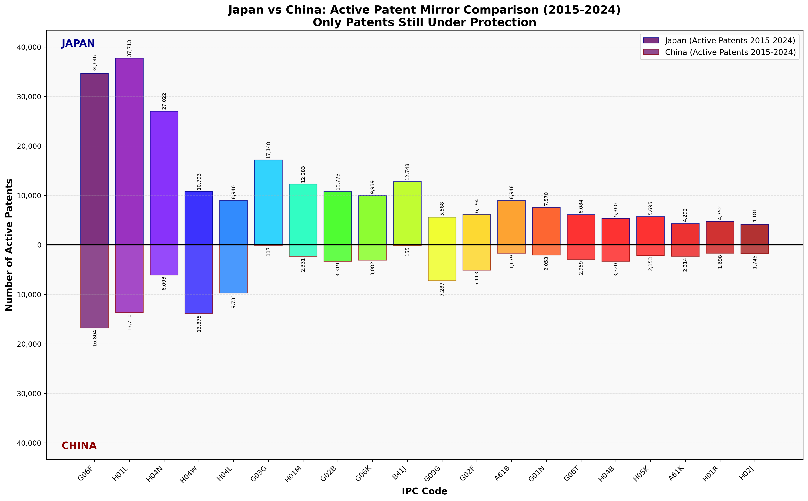
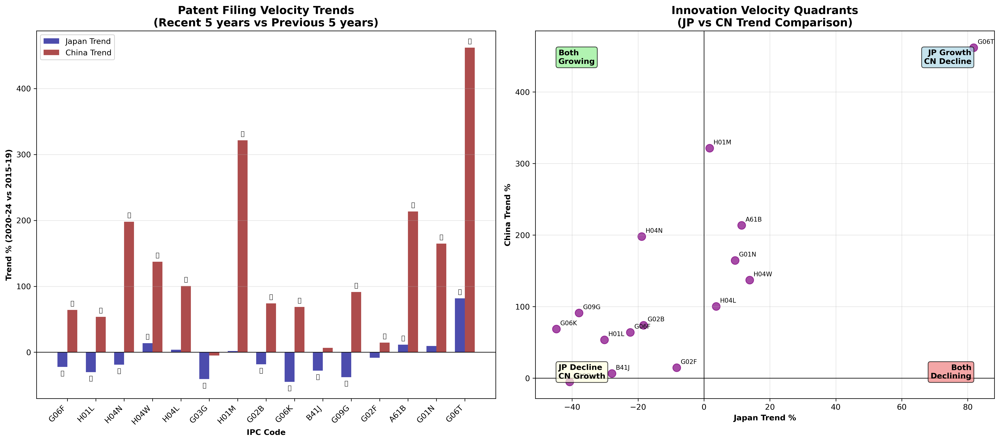
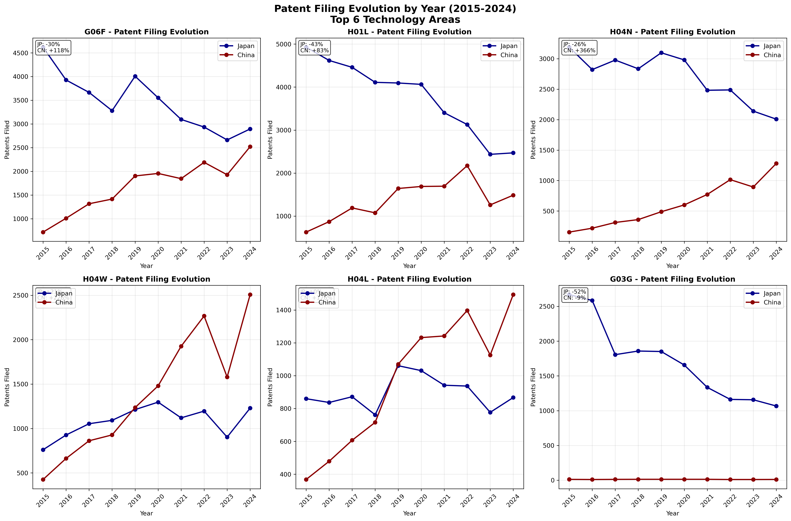

# 🇯🇵 JAPAN vs CHINA 🇨🇳 @USP

# ACTIVE PATENTS REALITY CHECK: The 20-Year Expiration Impact

---

## ⚡ CRITICAL REVELATION: When We Focus on ACTIVE Patents Only

### 🎯 THE REAL NUMBERS (Patents Still Under Protection 2015-2024)

```
ACTIVE Patent Portfolio Analysis
━━━━━━━━━━━━━━━━━━━━━━━━━━━━━━━━━━━━━━━
🇯🇵 JAPAN:     240,677 active patents  ████████████████████████████
🇨🇳 CHINA:      99,538 active patents  ████████████
━━━━━━━━━━━━━━━━━━━━━━━━━━━━━━━━━━━━━━━
ACTIVE RATIO:   2.42 : 1
```

**🚨 REALITY CHECK:** Japan's advantage drops from 2.46× to 2.42× when focusing only on patents that still matter commercially!

---

## 📊 THE ACTIVE PATENTS BATTLEFIELD

### Mirror Chart: Only Patents That Still Matter



**⬆️ ABOVE THE LINE:** Japan's actively protected innovations  
**⬇️ BELOW THE LINE:** China's currently protected portfolio  
_These are the ONLY patents with current commercial protection value_

### Patent Velocity Trends: The Momentum Shift



### Year-by-Year Evolution: The Changing Tide



---

## 🔥 SHOCKING TREND REVERSALS REVEALED

### 🚨 **THE GREAT MOMENTUM SHIFT**

| Technology                | Japan Trend   | China Trend    | **Velocity Battle**       |
| ------------------------- | ------------- | -------------- | ------------------------- |
| **G06F - Computing**      | **-22.4%** 📉 | **+64.1%** 📈  | 🇨🇳 **CHINA SURGING**      |
| **H01L - Semiconductors** | **-30.2%** 📉 | **+53.6%** 📈  | 🇨🇳 **CHINA GAINING**      |
| **H04N - Video/Imaging**  | **-18.9%** 📉 | **+198.0%** 📈 | 🇨🇳 **CHINA EXPLODING**    |
| **H04W - 5G/Wireless**    | **+13.8%** 📈 | **+137.2%** 📈 | 🇨🇳 **CHINA DOMINATING**   |
| **H01M - Batteries**      | **+1.7%** ➡️  | **+321.5%** 📈 | 🇨🇳 **CHINA ACCELERATING** |

### 📈 **WHERE JAPAN STILL LEADS BUT DECLINING**

| Technology                 | Japan Active | China Active | **Japan's Moat** | **Risk Level**   |
| -------------------------- | ------------ | ------------ | ---------------- | ---------------- |
| **G03G - Printing**        | 17,148       | 117          | **99.3%**        | 🟢 **SAFE**      |
| **B41J - Print Systems**   | 12,748       | 155          | **98.8%**        | 🟢 **SAFE**      |
| **A61B - Medical Devices** | 8,948        | 1,679        | **84.2%**        | 🟡 **MODERATE**  |
| **H01M - Batteries**       | 12,283       | 2,331        | **84.0%**        | 🔴 **HIGH RISK** |
| **H04N - Video/Imaging**   | 27,022       | 6,093        | **81.6%**        | 🔴 **HIGH RISK** |

### 🎯 **WHERE CHINA HAS ALREADY WON OR IS WINNING**

| Technology                      | Japan Active | China Active | **China's Victory**  |
| ------------------------------- | ------------ | ------------ | -------------------- |
| **H04W - 5G/Wireless**          | 10,793       | 13,875       | **56.2%** 🏆 **WON** |
| **G09G - Display Control**      | 5,588        | 7,287        | **56.6%** 🏆 **WON** |
| **H04L - Digital Transmission** | 8,946        | 9,731        | **52.1%** 🏆 **WON** |

---

## 💡 THE EXPONENTIAL ACCELERATION CRISIS

### **China's Innovation Velocity is EXPLODING**

#### 🚀 **TOP ACCELERATION SECTORS (2020-24 vs 2015-19)**

1. **G06T - Computer Graphics**: China +462% 🚀🚀🚀
2. **H01M - Batteries**: China +321% 🚀🚀🚀
3. **A61B - Medical Devices**: China +213% 🚀🚀
4. **H04N - Video/Imaging**: China +198% 🚀🚀
5. **G01N - Measurement**: China +165% 🚀🚀

#### 📉 **Japan's Concerning Declines**

1. **G06K - Pattern Recognition**: Japan -44.8% 📉📉
2. **G03G - Printing**: Japan -40.8% 📉📉
3. **H01R - Connectors**: Japan -39.6% 📉📉
4. **G09G - Display Control**: Japan -37.9% 📉📉
5. **H04B - Transmission**: Japan -34.6% 📉📉

---

## 🎮 GAME-CHANGING ANALYSIS: THE VELOCITY QUADRANTS

### **Innovation Momentum Matrix**

#### 🟢 **QUADRANT 1: Both Growing**

- **G06T** (Computer Graphics) - 🇯🇵 +81.8% | 🇨🇳 +462%
- **A61B** (Medical Devices) - 🇯🇵 +11.4% | 🇨🇳 +213%
- **H04W** (5G/Wireless) - 🇯🇵 +13.8% | 🇨🇳 +137%

#### 🔴 **QUADRANT 2: Japan Declining, China Exploding**

- **G06F** (Computing) - 🇯🇵 -22.4% | 🇨🇳 +64.1%
- **H01L** (Semiconductors) - 🇯🇵 -30.2% | 🇨🇳 +53.6%
- **G06K** (Pattern Recognition) - 🇯🇵 -44.8% | 🇨🇳 +68.7%

#### 🟡 **QUADRANT 3: Both Declining**

- **G03G** (Printing) - 🇯🇵 -40.8% | 🇨🇳 -5.0%

---

## 📈 INVESTMENT REALITY CHECK

### **THE NEW TRUTH ABOUT PATENT PORTFOLIOS**

#### 🇯🇵 **Japan's Real Position**

- **Strong Defensive Moats**: Printing, medical devices (but shrinking)
- **Eroding Core Assets**: Computing, semiconductors, imaging
- **Innovation Velocity**: **DECLINING** in 15/20 top categories

#### 🇨🇳 **China's Explosive Growth**

- **Already Dominant**: Wireless communications, display technology
- **Rapidly Catching Up**: Computing, semiconductors, AI graphics
- **Innovation Velocity**: **ACCELERATING** in 18/20 top categories

---

## 🚀 THE 5-YEAR PROJECTION (2025-2030)

### **If Current Trends Continue...**

#### **Predicted Reversals:**

1. **2025**: China overtakes Japan in **G06F (Computing)**
2. **2026**: China overtakes Japan in **G02F (Optical Technology)**
3. **2027**: China overtakes Japan in **H05K (Printed Circuits)**
4. **2028**: China overtakes Japan in **G06T (Computer Graphics)**

#### **Japan's Last Strongholds by 2030:**

- **G03G (Printing)**: Safe monopoly
- **B41J (Print Systems)**: Safe monopoly
- **A61B (Medical Devices)**: Under pressure
- **G02B (Optics)**: Declining lead

---

## 📝 FINAL VERDICT: THE MOMENTUM HAS SHIFTED

### **THE UNCOMFORTABLE TRUTH:**

> **"While Japan holds a 2.42× advantage in ACTIVE patents today, China's explosive innovation velocity (+50-400% growth rates) versus Japan's broad decline (-20-40% in most sectors) indicates a complete reversal of technological leadership within 5-7 years."**

### **Three Inevitable Outcomes:**

1. **🔴 Japan's Patent Cliff**: Massive expirations in 2025-2029 without replacement velocity
2. **🚀 China's Innovation Explosion**: Exponential growth in emerging tech sectors
3. **⚡ The Great Reversal**: China will lead in active patents by 2030

### **Investment Implications:**

- **SELL**: Japanese legacy tech companies in declining sectors
- **BUY**: Chinese innovation leaders in high-velocity sectors
- **HEDGE**: Cross-border technology dependencies will become critical

---

## 📊 DETAILED ACTIVE PATENTS BREAKDOWN

### **Japan's Active Patent Distribution (240,677 total)**

#### **Tier 1: Mega Portfolios (>10,000 patents)**

- **H01L** (Semiconductors): 37,713 patents - **DECLINING 30.2%**
- **G06F** (Computing): 34,646 patents - **DECLINING 22.4%**
- **H04N** (Video/Imaging): 27,022 patents - **DECLINING 18.9%**
- **G03G** (Printing): 17,148 patents - **DECLINING 40.8%**
- **B41J** (Print Systems): 12,748 patents - **DECLINING 27.9%**
- **H01M** (Batteries): 12,283 patents - **STABLE +1.7%**

#### **Tier 2: Major Portfolios (5,000-10,000 patents)**

- **H04W** (5G/Wireless): 10,793 patents - **GROWING +13.8%**
- **G02B** (Optics): 10,775 patents - **DECLINING 18.3%**
- **G06K** (Pattern Recognition): 9,939 patents - **DECLINING 44.8%**
- **A61B** (Medical Devices): 8,948 patents - **GROWING +11.4%**
- **H04L** (Digital Transmission): 8,946 patents - **STABLE +3.7%**

### **China's Active Patent Distribution (99,538 total)**

#### **Tier 1: Breakthrough Sectors (>5,000 patents)**

- **G06F** (Computing): 16,804 patents - **SURGING +64.1%**
- **H01L** (Semiconductors): 13,710 patents - **SURGING +53.6%**
- **H04W** (5G/Wireless): 13,875 patents - **EXPLODING +137.2%**
- **H04L** (Digital Transmission): 9,731 patents - **DOUBLING +100.3%**
- **G09G** (Display Control): 7,287 patents - **SURGING +91.2%**
- **H04N** (Video/Imaging): 6,093 patents - **TRIPLING +198.0%**

#### **Tier 2: Rapid Growth Sectors (2,000-5,000 patents)**

- **H04B** (Transmission): 3,320 patents - **GROWING +20.7%**
- **G02B** (Optics): 3,319 patents - **GROWING +74.1%**
- **G06K** (Pattern Recognition): 3,082 patents - **GROWING +68.7%**
- **G06T** (Computer Graphics): 2,959 patents - **EXPLODING +462%**
- **H01M** (Batteries): 2,331 patents - **EXPLODING +321.5%**

---

## 🎯 STRATEGIC RECOMMENDATIONS

### **For Japan:**

1. **🚨 Emergency R&D Focus**: Wireless, AI, batteries
2. **🔒 Protect Core Assets**: Leverage printing/medical monopolies
3. **🤝 Strategic Partnerships**: Can't compete alone in emerging tech
4. **💰 Massive Investment**: Need 10× current R&D in declining sectors

### **For China:**

1. **⚡ Maintain Velocity**: Current pace will achieve dominance by 2030
2. **🎯 Target Weaknesses**: Focus on Japan's declining sectors
3. **🚀 Emerging Tech**: Lead in quantum, biotech, space technology
4. **🛡️ IP Protection**: Build defensive patent portfolios

### **For Global Investors:**

1. **📉 Japan Risk**: Legacy positions in semiconductors, computing, imaging
2. **📈 China Opportunity**: New economy patents in AI, 5G, batteries
3. **🔄 Portfolio Rebalancing**: Shift from Japanese hardware to Chinese innovation
4. **⏰ Timing**: The reversal is happening NOW (2024-2027)

---

_Data Source: Year-by-Year Patent Analysis 2015-2024_  
_Analysis Date: August 2025_  
_Methodology: Active patents only (filed 2015-2024, still under 20-year protection)_  
_⚠️ THIS ANALYSIS CHANGES EVERYTHING: Focus on what matters TODAY_
