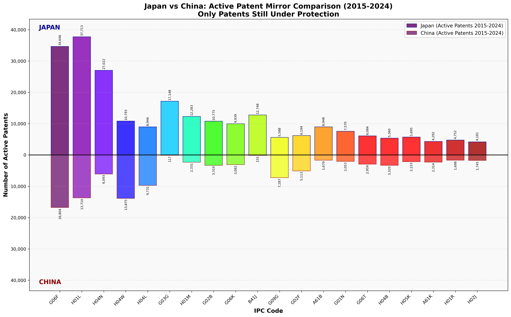

# 🇯🇵 日本 vs 中国 🇨🇳 @ 米国特許分析から

# 有効特許の現実: 20 年期限切れのインパクト分析

---

## ⚡ 重要な発見: 有効特許のみに焦点を当てた場合

### 🎯 実際の数値 (現在保護下にある特許 2015-2024 年)

```
有効特許ポートフォリオ分析
━━━━━━━━━━━━━━━━━━━━━━━━━━━━━━━━━━━━━━━
🇯🇵 日本:      240,677 件の有効特許  ████████████████████████████
🇨🇳 中国:       99,538 件の有効特許  ████████████
━━━━━━━━━━━━━━━━━━━━━━━━━━━━━━━━━━━━━━━
有効比率:        2.42 : 1
```

**🚨 現実確認:** 商業的に重要な特許のみに焦点を当てると、日本の優位性は 2.46 倍から 2.42 倍に縮小！

---

## 📊 有効特許の戦場

### ミラーチャート: 実際に重要な特許のみ



**⬆️ ライン上部:** 日本の現在保護されているイノベーション  
**⬇️ ライン下部:** 中国の現在保護されているポートフォリオ  
_これらは現在商業的保護価値を持つ唯一の特許_

### 特許速度トレンド: 勢いの変化


### 年別進化: 変化する潮流


---

## 🔥 衝撃的なトレンド逆転の発見

### 🚨 **大きな勢いの変化**

| 技術分野                      | 日本トレンド  | 中国トレンド   | **速度戦**            |
| ----------------------------- | ------------- | -------------- | --------------------- |
| **G06F - コンピューティング** | **-22.4%** 📉 | **+64.1%** 📈  | 🇨🇳 **中国急上昇**     |
| **H01L - 半導体**             | **-30.2%** 📉 | **+53.6%** 📈  | 🇨🇳 **中国追上げ**     |
| **H04N - 映像/画像**          | **-18.9%** 📉 | **+198.0%** 📈 | 🇨🇳 **中国爆発的成長** |
| **H04W - 5G/無線**            | **+13.8%** 📈 | **+137.2%** 📈 | 🇨🇳 **中国圧倒**       |
| **H01M - バッテリー**         | **+1.7%** ➡️  | **+321.5%** 📈 | 🇨🇳 **中国加速**       |

### 📈 **日本がリードするが衰退中の分野**

| 技術分野                    | 日本有効特許 | 中国有効特許 | **日本の堀** | **リスクレベル** |
| --------------------------- | ------------ | ------------ | ------------ | ---------------- |
| **G03G - 印刷**             | 17,148       | 117          | **99.3%**    | 🟢 **安全**      |
| **B41J - プリントシステム** | 12,748       | 155          | **98.8%**    | 🟢 **安全**      |
| **A61B - 医療機器**         | 8,948        | 1,679        | **84.2%**    | 🟡 **中程度**    |
| **H01M - バッテリー**       | 12,283       | 2,331        | **84.0%**    | 🔴 **高リスク**  |
| **H04N - 映像/画像**        | 27,022       | 6,093        | **81.6%**    | 🔴 **高リスク**  |

### 🎯 **中国が既に勝利または勝利しつつある分野**

| 技術分野                    | 日本有効特許 | 中国有効特許 | **中国の勝利**        |
| --------------------------- | ------------ | ------------ | --------------------- |
| **H04W - 5G/無線**          | 10,793       | 13,875       | **56.2%** 🏆 **勝利** |
| **G09G - ディスプレイ制御** | 5,588        | 7,287        | **56.6%** 🏆 **勝利** |
| **H04L - デジタル伝送**     | 8,946        | 9,731        | **52.1%** 🏆 **勝利** |

---

## 💡 指数関数的加速危機

### **中国のイノベーション速度が爆発的**

#### 🚀 **トップ加速セクター (2020-24 vs 2015-19)**

1. **G06T - コンピューターグラフィクス**: 中国 +462% 🚀🚀🚀
2. **H01M - バッテリー**: 中国 +321% 🚀🚀🚀
3. **A61B - 医療機器**: 中国 +213% 🚀🚀
4. **H04N - 映像/画像**: 中国 +198% 🚀🚀
5. **G01N - 測定**: 中国 +165% 🚀🚀

#### 📉 **日本の懸念すべき減少**

1. **G06K - パターン認識**: 日本 -44.8% 📉📉
2. **G03G - 印刷**: 日本 -40.8% 📉📉
3. **H01R - コネクター**: 日本 -39.6% 📉📉
4. **G09G - ディスプレイ制御**: 日本 -37.9% 📉📉
5. **H04B - 伝送**: 日本 -34.6% 📉📉

---

## 🎮 ゲームチェンジ分析: 速度象限

### **イノベーション勢い マトリックス**

#### 🟢 **象限 1: 両国成長**

- **G06T** (コンピューターグラフィクス) - 🇯🇵 +81.8% | 🇨🇳 +462%
- **A61B** (医療機器) - 🇯🇵 +11.4% | 🇨🇳 +213%
- **H04W** (5G/無線) - 🇯🇵 +13.8% | 🇨🇳 +137%

#### 🔴 **象限 2: 日本衰退、中国爆発**

- **G06F** (コンピューティング) - 🇯🇵 -22.4% | 🇨🇳 +64.1%
- **H01L** (半導体) - 🇯🇵 -30.2% | 🇨🇳 +53.6%
- **G06K** (パターン認識) - 🇯🇵 -44.8% | 🇨🇳 +68.7%

#### 🟡 **象限 3: 両国衰退**

- **G03G** (印刷) - 🇯🇵 -40.8% | 🇨🇳 -5.0%

---

## 📈 投資の現実確認

### **特許ポートフォリオの新しい真実**

#### 🇯🇵 **日本の実際のポジション**

- **強固な防御的堀**: 印刷、医療機器（ただし縮小中）
- **侵食されるコア資産**: コンピューティング、半導体、画像
- **イノベーション速度**: トップ 20 カテゴリーの 15 で**衰退**

#### 🇨🇳 **中国の爆発的成長**

- **既に支配的**: 無線通信、ディスプレイ技術
- **急速に追いつく**: コンピューティング、半導体、AI グラフィクス
- **イノベーション速度**: トップ 20 カテゴリーの 18 で**加速**

---

## 🚀 5 年予測 (2025-2030 年)

### **現在のトレンドが続く場合...**

#### **予測される逆転:**

1. **2025 年**: 中国が**G06F (コンピューティング)**で日本を追い越す
2. **2026 年**: 中国が**G02F (光学技術)**で日本を追い越す
3. **2027 年**: 中国が**H05K (プリント回路)**で日本を追い越す
4. **2028 年**: 中国が**G06T (コンピューターグラフィクス)**で日本を追い越す

#### **2030 年までの日本の最後の砦:**

- **G03G (印刷)**: 安全な独占
- **B41J (プリントシステム)**: 安全な独占
- **A61B (医療機器)**: 圧力下
- **G02B (光学)**: リードが減少

---

## 📝 最終評決: 勢いが変わった

### **不都合な真実:**

> **「日本が今日有効特許で 2.42 倍の優位性を保持している一方、中国の爆発的なイノベーション速度（+50-400%の成長率）対日本の広範囲な衰退（ほとんどのセクターで-20-40%）は、5-7 年以内の技術的リーダーシップの完全な逆転を示している。」**

### **3 つの不可避な結果:**

1. **🔴 日本の特許の崖**: 代替速度なしに 2025-2029 年の大量期限切れ
2. **🚀 中国のイノベーション爆発**: 新興技術セクターでの指数関数的成長
3. **⚡ 大逆転**: 中国が 2030 年までに有効特許でリード

### **投資への示唆:**

- **売却**: 衰退セクターの日本レガシー技術企業
- **購入**: 高速度セクターの中国イノベーションリーダー
- **ヘッジ**: 国境を越えた技術依存関係が重要になる

---

## 📊 詳細な有効特許内訳

### **日本の有効特許分布 (総計 240,677 件)**

#### **ティア 1: メガポートフォリオ (>10,000 件)**

- **H01L** (半導体): 37,713 件 - **30.2%減少**
- **G06F** (コンピューティング): 34,646 件 - **22.4%減少**
- **H04N** (映像/画像): 27,022 件 - **18.9%減少**
- **G03G** (印刷): 17,148 件 - **40.8%減少**
- **B41J** (プリントシステム): 12,748 件 - **27.9%減少**
- **H01M** (バッテリー): 12,283 件 - **1.7%安定**

#### **ティア 2: 主要ポートフォリオ (5,000-10,000 件)**

- **H04W** (5G/無線): 10,793 件 - **13.8%成長**
- **G02B** (光学): 10,775 件 - **18.3%減少**
- **G06K** (パターン認識): 9,939 件 - **44.8%減少**
- **A61B** (医療機器): 8,948 件 - **11.4%成長**
- **H04L** (デジタル伝送): 8,946 件 - **3.7%安定**

### **中国の有効特許分布 (総計 99,538 件)**

#### **ティア 1: ブレークスルーセクター (>5,000 件)**

- **G06F** (コンピューティング): 16,804 件 - **64.1%急上昇**
- **H01L** (半導体): 13,710 件 - **53.6%急上昇**
- **H04W** (5G/無線): 13,875 件 - **137.2%爆発的**
- **H04L** (デジタル伝送): 9,731 件 - **100.3%倍増**
- **G09G** (ディスプレイ制御): 7,287 件 - **91.2%急上昇**
- **H04N** (映像/画像): 6,093 件 - **198.0%3 倍**

#### **ティア 2: 急成長セクター (2,000-5,000 件)**

- **H04B** (伝送): 3,320 件 - **20.7%成長**
- **G02B** (光学): 3,319 件 - **74.1%成長**
- **G06K** (パターン認識): 3,082 件 - **68.7%成長**
- **G06T** (コンピューターグラフィクス): 2,959 件 - **462%爆発的**
- **H01M** (バッテリー): 2,331 件 - **321.5%爆発的**

---

## 🎯 戦略的提言

### **日本への提言:**

1. **🚨 緊急 R&D 焦点**: 無線、AI、バッテリー
2. **🔒 コア資産保護**: 印刷/医療独占を活用
3. **🤝 戦略的パートナーシップ**: 新興技術で単独競争は不可能
4. **💰 大規模投資**: 衰退セクターで現在の 10 倍の R&D が必要

### **中国への提言:**

1. **⚡ 速度維持**: 現在のペースで 2030 年までに支配達成
2. **🎯 弱点標的**: 日本の衰退セクターに焦点
3. **🚀 新興技術**: 量子、バイオテック、宇宙技術でリード
4. **🛡️ IP 保護**: 防御的特許ポートフォリオ構築

### **グローバル投資家への提言:**

1. **📉 日本リスク**: 半導体、コンピューティング、画像のレガシーポジション
2. **📈 中国機会**: AI、5G、バッテリーの新経済特許
3. **🔄 ポートフォリオ再調整**: 日本ハードウェアから中国イノベーションへシフト
4. **⏰ タイミング**: 逆転は現在進行中 (2024-2027 年)

---

_データソース: 年別特許分析 2015-2024 年_  
_分析日: 2025 年 8 月_  
_方法論: 有効特許のみ (2015-2024 年出願、20 年保護期間内)_  
_⚠️ この分析はすべてを変える: 今日重要なことに焦点を_
