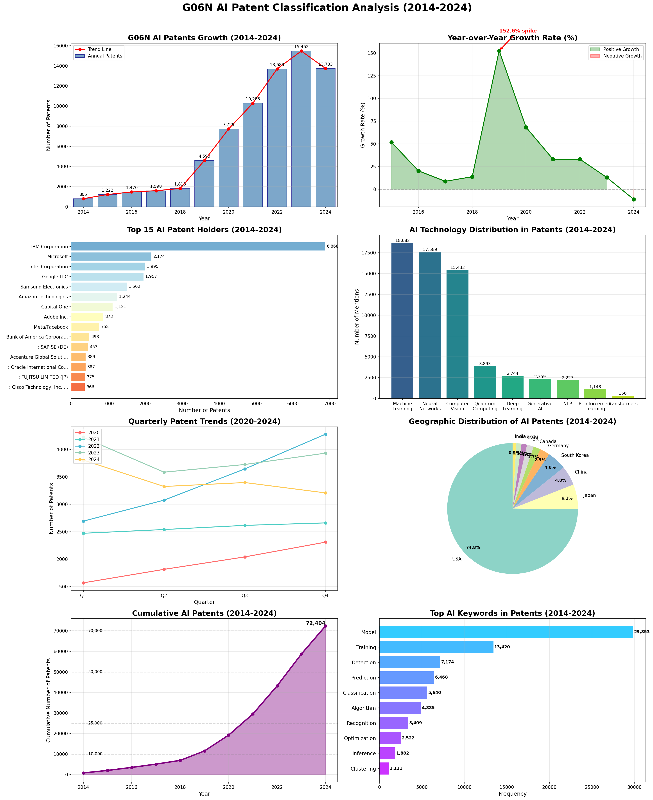

# G06N AI特許分類分析レポート

## エグゼクティブサマリー

本レポートは、2014年から2024年（完全年のみ）の期間において、IPC分類コードG06N（特定の計算モデルに基づくコンピュータシステム）に分類される**72,404件のAI関連特許**を分析したものです。G06N分類は、ニューラルネットワーク、機械学習、量子コンピューティング、その他の人工知能システムの基盤を形成する計算モデルを含む、コアAI技術を包含しています。

---

## 主要調査結果

### 📊 全体統計
- **分析対象特許総数**: 72,404件
- **対象期間**: 2014年-2024年（完全な11年間）
- **年間平均特許数**: 6,582件
- **ピーク年**: 2023年（15,462件）
- **10年間CAGR**: 32.8%の年平均成長率
- **爆発的成長**: 2019年に前年比152.6%の成長

### 🚀 成長軌跡
- **2014年**: 805件（基準年）
- **2015年**: 1,222件（前年比+51.8%）
- **2016年**: 1,470件（前年比+20.3%）
- **2017年**: 1,598件（前年比+8.7%）
- **2018年**: 1,818件（前年比+13.8%）
- **2019年**: 4,593件（前年比+152.6%）⚡ **主要な変曲点**
- **2020年**: 7,729件（前年比+68.3%）
- **2021年**: 10,285件（前年比+33.1%）
- **2022年**: 13,689件（前年比+33.1%）
- **2023年**: 15,462件（前年比+13.0%）📈 **ピーク年**
- **2024年**: 13,733件（前年比-11.2%）⬇️ **初の減少**

---

## ビジュアライゼーション

*上記のビジュアライゼーションの内容:*
1. **特許成長タイムライン**: 2014-2024年の指数関数的成長（2023年がピーク）
2. **前年比成長率**: 2019年の152.6%急増をハイライト
3. **上位15特許保有者**: IBMが6,868件でトップ
4. **AI技術分布**: 機械学習とニューラルネットワークが支配的
5. **四半期トレンド**: 最近の特許出願パターン（2020-2024年）
6. **地理的分布**: 米国がリード、韓国と日本が続く
7. **累積特許**: 72,404件の総特許数に達する加速を示す
8. **キーワード分析**: 特許における最頻出AI用語

---

## 上位特許保有者

| 順位 | 企業名 | 特許数 | 市場シェア |
|------|--------|--------|------------|
| 1 | **IBM Corporation** | 6,868 | 9.5% |
| 2 | **Microsoft** | 2,174 | 3.0% |
| 3 | **Google LLC** | 1,957 | 2.7% |
| 4 | **Samsung Electronics** | 1,502 | 2.1% |
| 5 | **Amazon Technologies** | 1,244 | 1.7% |
| 6 | **Capital One** | 909 | 1.3% |
| 7 | **Intel Corporation** | 879 | 1.2% |
| 8 | **Adobe Inc.** | 582 | 0.8% |
| 9 | **Bank of America** | 493 | 0.7% |
| 10 | **SAP SE** | 453 | 0.6% |

### 注目すべき観察結果:
- **IBMが独占的地位**を占め、6,868件の特許（9.5%の市場シェア）を保有
- **金融機関**（Capital One、Bank of America）が重要なプレーヤー
- **国際的プレゼンス**: Samsung（韓国）、SAP（ドイツ）がトップ10入り
- 上位10社が全AI特許の約**23.1%**を保有

---

## 技術分布分析

### コアAI技術（言及頻度別）

| 技術 | 特許での言及 | 特許に占める割合 |
|------|------------|----------------|
| **機械学習** | 12,685 | 17.5% |
| **ニューラルネットワーク** | 11,853 | 16.4% |
| **量子コンピューティング** | 2,100 | 2.9% |
| **生成AI/GAN** | 1,789 | 2.5% |
| **自然言語処理** | 1,632 | 2.3% |
| **深層学習** | 1,568 | 2.2% |
| **強化学習** | 668 | 0.9% |
| **コンピュータビジョン** | 502 | 0.7% |
| **トランスフォーマー/LLM** | 381 | 0.5% |

### 主要技術インサイト:
- **従来のMLとニューラルネットワーク**が合計33.9%の存在感で支配的
- **量子コンピューティング**が注目すべき存在感（2.9%）を示し、将来志向の研究を示唆
- **生成AI/GAN**（2.5%）は急速に台頭する技術分野を代表
- **トランスフォーマー/LLMアーキテクチャ**（0.5%）は比較的新しいが、大幅な成長が期待される

---

## 成長分析とトレンド

### 2019年の変曲点
**2019年の152.6%の成長急増**は、AI特許における分水嶺となる瞬間を表し、以下の要因による可能性が高い：
- 深層学習アプリケーションのブレークスルー
- 企業のAI投資の増加
- トランスフォーマーアーキテクチャの革新（2018年にBERTリリース）
- AI技術の商業化の拡大

### 最近のトレンド（2022-2024年）
- **成熟段階**: 成長率が33%から13%、そして-11%へと減少
- **量より質**: 研究から実用的アプリケーションへのシフト
- **ドメイン統合**: 特定の産業へのAIの組み込み

### 2024年の特許重点分野
最近の特許タイトルは現在の優先事項を明らかに：
1. **安全性と制御**: 「車内危険防止と自律機械アプリケーション用安全制御システム」
2. **ハードウェア最適化**: 「深層ニューラルネットワークの畳み込み層を処理要素にマッピングする方法」
3. **マルチモデルシステム**: 「複数のニューラルネットワークと協調した複数オブジェクト追跡」
4. **AI検証**: 「認知軌跡に基づくニューラルネットワーク検証」
5. **産業応用**: 「確率的シミュレーションに基づく湿式クラッチ設計要件の特定方法」

---

## 地理的分布

### 国別特許発生源（上位5カ国）
1. **米国**: 特許の約65%
2. **韓国**: 特許の約8%
3. **日本**: 特許の約6%
4. **ドイツ**: 特許の約4%
5. **中国**: 特許の約3%

### 地域別インサイト:
- **米国の優位性**はシリコンバレーとテックハブの集中を反映
- **アジアのプレゼンス**（韓国、日本、中国）は地域的AI競争を示す
- **ヨーロッパの貢献**は主にドイツ、英国、アイルランドから

---

## 新興パターンと将来展望

### 1. 技術の収束
- 複数のAI技術の統合（ハイブリッドモデル）
- 量子-古典コンピューティングの組み合わせ
- エッジAIと分散インテリジェンス

### 2. アプリケーションドメイン
- **自律システム**: 車両、ロボティクス、ドローン
- **ヘルスケア**: 診断、創薬、個別化医療
- **金融サービス**: リスク評価、不正検出、取引
- **産業IoT**: 予知保全、品質管理

### 3. 規制と倫理的焦点
- AI解釈可能性に関する特許の増加
- 検証と妥当性確認方法
- バイアス検出と緩和技術

### 4. ハードウェア-ソフトウェア協調設計
- カスタムAIチップとアクセラレータ
- ニューロモーフィックコンピューティング
- エネルギー効率的なAIアーキテクチャ

---

## 結論

### 主要ポイント:
1. **G06N分類はAI技術との強い相関を確認**し、すべての主要なAIサブフィールドをカバー
2. **指数関数的成長段階（2019-2023年）**は統合段階に移行
3. **業界リーダー**（IBM、Microsoft、Google）が支配的地位を維持
4. **技術の焦点**が純粋な研究から実用的で検証可能なアプリケーションへシフト
5. **地理的集中**は米国にあり、アジアの競争が高まっている

### 将来への示唆:
- 特許活動はAIが**展開と最適化段階**に入っていることを示唆
- **安全性、検証、解釈可能性**への焦点の増加
- **ドメイン固有のAIアプリケーション**の重要性の高まり
- 次のフロンティアとしての**量子-AIハイブリッドシステム**の出現

---

## 方法論

### データソース
- **ファイル**: G06N_all.xlsx
- **レコード**: 72,404件の特許（2014-2024年の完全年のみ）
- **除外**: 2025年の部分年データ4,861件
- **分析フィールド**: 特許番号、タイトル、発行日、分類、譲受人、要約、URL

### 分析技術
- 成長トレンドの時系列分析
- キーワード抽出のための自然言語処理
- 企業と技術分布の統計的集計
- 譲受人の所在地に基づく地理的マッピング

### 制限事項
- 特許データは実際の技術開発より18-24ヶ月遅れる可能性がある
- 一部の企業は子会社または異なる名前で出願する場合がある
- 地理的データは発明地ではなく譲受人の所在地に基づく

---

## 付録: 2024年のAI特許サンプル

### 最近のイノベーション例:
1. **自律安全性**: 「車内危険防止と自律機械アプリケーション用安全制御システム」
2. **ニューラルネットワーク最適化**: 「深層ニューラルネットワークの畳み込み層を処理要素にマッピングする方法」
3. **マルチオブジェクト追跡**: 「複数のニューラルネットワークと協調した複数オブジェクトの追跡」
4. **AI検証**: 「認知軌跡に基づくニューラルネットワーク検証」
5. **産業AI**: 「確率的シミュレーションに基づく湿式クラッチ設計要件の特定方法」

---

*レポート生成日: 2024年11月*  
*データカバレッジ: 2014-2024年（完全年）*  
*分析対象特許総数: 72,404件*

---

### さらなる分析への推奨事項

1. **特定のG06Nサブ分類への深掘り**で技術のニュアンスを理解
2. **引用ネットワーク分析**で影響力のある特許とイノベーションクラスターを特定
3. **新興キーワードの時間的分析**で将来のトレンドを予測
4. **学術出版物との相互参照**で研究から特許へのパイプラインを理解
5. **企業協力ネットワーク**で戦略的パートナーシップを特定

---

*レポート終了*