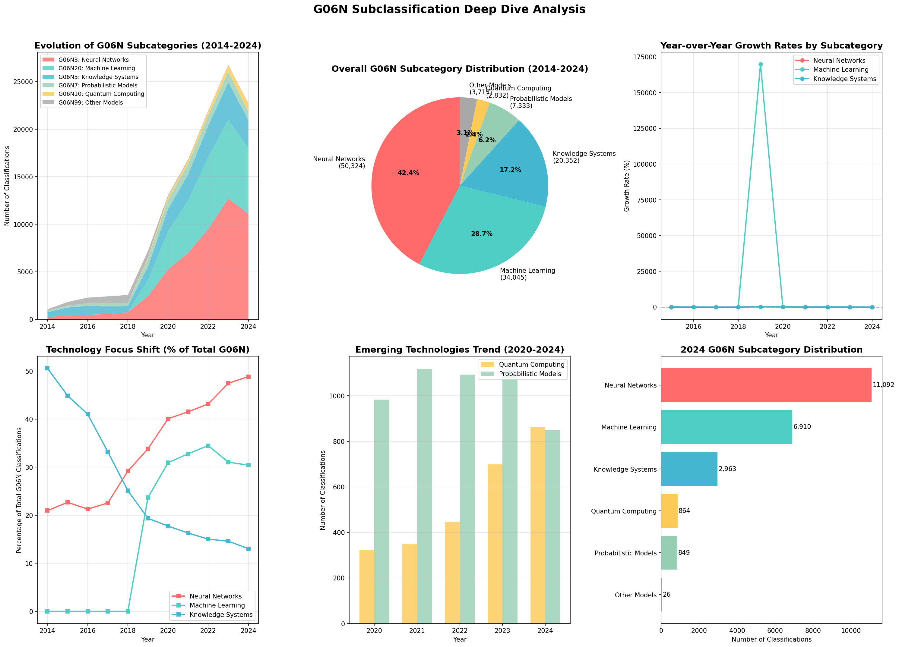

# G06N Subclassification Deep Dive Analysis Report

## Executive Summary

This report provides a detailed analysis of G06N patent subclassifications from 2014-2024, revealing the technological nuances within AI patents. The analysis of 72,404 patents containing 118,602 G06N classification occurrences shows that Neural Networks (G06N3) dominate with 42.4% of classifications, followed by Machine Learning (G06N20) at 28.7%. All major subcategories experienced decline in 2024, suggesting broad market consolidation.

---

## G06N IPC Subclassification Structure

| Code | Category | Description | Focus Areas |
|------|----------|-------------|-------------|
| **G06N3** | Neural Networks | Biological model-based computing | Deep learning, CNNs, RNNs, transformers |
| **G06N5** | Knowledge Systems | Expert systems and logic-based AI | Rule engines, ontologies, reasoning |
| **G06N7** | Probabilistic Models | Uncertainty handling systems | Bayesian networks, fuzzy logic |
| **G06N10** | Quantum Computing | Quantum computational models | Quantum algorithms, qubits |
| **G06N20** | Machine Learning | General ML algorithms | Supervised, unsupervised, reinforcement |
| **G06N99** | Other Models | Alternative computational paradigms | Hybrid systems, novel approaches |

---

## Key Findings

### Overall Distribution (2014-2024)

| Subcategory | Classification Count | Percentage | Patents Using |
|-------------|---------------------|------------|---------------|
| **G06N3 - Neural Networks** | 50,324 | 42.4% | ~35,000 |
| **G06N20 - Machine Learning** | 34,045 | 28.7% | ~28,000 |
| **G06N5 - Knowledge Systems** | 20,352 | 17.2% | ~16,000 |
| **G06N7 - Probabilistic** | 7,333 | 6.2% | ~6,500 |
| **G06N99 - Other Models** | 3,715 | 3.1% | ~3,500 |
| **G06N10 - Quantum Computing** | 2,832 | 2.4% | ~2,500 |

### Top Detailed Classifications

| Classification | Description | Count | % of Total |
|----------------|-------------|-------|------------|
| **G06N20/00** | Machine learning (general) | 30,361 | 25.60% |
| **G06N3/08** | Learning methods for neural networks | 19,660 | 16.58% |
| **G06N3/04** | Neural network architecture/structure | 13,277 | 11.19% |
| **G06N5/04** | Inference methods in knowledge systems | 9,915 | 8.36% |
| **G06N5/02** | Knowledge representation | 6,264 | 5.28% |
| **G06N7/00** | Probabilistic models (general) | 5,163 | 4.35% |
| **G06N3/063** | Physical realization of neural networks | 3,219 | 2.71% |
| **G06N3/045** | Combinations of neural networks | 2,596 | 2.19% |
| **G06N10/00** | Quantum computing (general) | 2,193 | 1.85% |
| **G06N20/20** | Kernel methods in ML | 2,182 | 1.84% |

---

## Temporal Analysis & Trends

### Year-over-Year Evolution (2020-2024)

#### Neural Networks (G06N3)
- 2020: 5,230 classifications
- 2021: 6,982 (+33.5%)
- 2022: 9,472 (+35.7%)
- 2023: 12,709 (+34.2%)
- 2024: 11,092 (-12.7%) ⬇️

#### Machine Learning (G06N20)
- 2020: 4,036 classifications
- 2021: 5,512 (+36.6%)
- 2022: 7,572 (+37.4%)
- 2023: 8,315 (+9.8%)
- 2024: 6,910 (-16.9%) ⬇️

#### Knowledge Systems (G06N5)
- 2020: 2,316 classifications
- 2021: 2,741 (+18.4%)
- 2022: 3,300 (+20.4%)
- 2023: 3,911 (+18.5%)
- 2024: 2,963 (-24.2%) ⬇️

### Technology Focus Shift

| Period | Dominant Technology | Key Observation |
|--------|-------------------|-----------------|
| **2014-2016** | Knowledge Systems (G06N5) | Traditional AI dominated early period |
| **2017-2019** | Transition Period | Neural networks gaining momentum |
| **2020-2023** | Neural Networks (G06N3) | Deep learning explosion, 40%+ share |
| **2024** | Market Consolidation | All categories decline, focus on quality |

---

## Technology Deep Dive

### 1. Neural Networks (G06N3) - 42.4% Share

**Key Subclassifications:**
- **G06N3/08**: Learning methods (backpropagation, gradient descent)
- **G06N3/04**: Architecture (CNNs, RNNs, transformers)
- **G06N3/063**: Hardware implementation
- **G06N3/045**: Ensemble and hybrid networks

**Patent Focus Areas:**
- Computer vision applications
- Natural language processing
- Autonomous systems
- Medical diagnosis

### 2. Machine Learning (G06N20) - 28.7% Share

**Key Subclassifications:**
- **G06N20/00**: General ML algorithms
- **G06N20/10**: Ensemble learning (random forests, boosting)
- **G06N20/20**: Kernel methods (SVM, Gaussian processes)

**Patent Focus Areas:**
- Predictive analytics
- Recommendation systems
- Fraud detection
- Industrial optimization

### 3. Knowledge Systems (G06N5) - 17.2% Share

**Key Subclassifications:**
- **G06N5/04**: Inference engines
- **G06N5/02**: Knowledge representation
- **G06N5/022**: Ontologies and semantic networks

**Patent Focus Areas:**
- Expert systems
- Decision support
- Regulatory compliance
- Knowledge graphs

### 4. Emerging Technologies

#### Quantum Computing (G06N10) - 2.4% Share
- Steady growth despite small share
- Focus on quantum algorithms and error correction
- Key players: IBM, Google, Microsoft

#### Probabilistic Models (G06N7) - 6.2% Share
- Bayesian networks for uncertainty quantification
- Fuzzy logic for control systems
- Applications in risk assessment

---

## Market Insights

### 2024 Market Signals

1. **Broad Decline Across All Categories**
   - Neural Networks: -12.7%
   - Machine Learning: -16.9%
   - Knowledge Systems: -24.2%
   - Indicates market-wide consolidation

2. **Technology Maturation**
   - Shift from quantity to quality
   - Focus on practical implementations
   - Integration rather than innovation

3. **Persistent Hierarchy**
   - Neural networks maintain dominance
   - Traditional AI (knowledge systems) remains relevant
   - Quantum computing still nascent (2.4%)

### Innovation Patterns

| Technology | Innovation Stage | Market Position |
|------------|-----------------|-----------------|
| Neural Networks | Mature/Optimizing | Dominant (42.4%) |
| Machine Learning | Mature | Strong (28.7%) |
| Knowledge Systems | Stable/Legacy | Significant (17.2%) |
| Probabilistic | Niche Applications | Specialized (6.2%) |
| Quantum Computing | Early/Experimental | Emerging (2.4%) |

---

## Strategic Implications

### For Research & Development
1. **Neural Networks** remain the primary investment area
2. **Hybrid approaches** combining G06N3 + G06N20 increasing
3. **Quantum computing** presents long-term opportunity

### For Patent Strategy
1. **Differentiation** needed in crowded G06N3/G06N20 space
2. **Niche opportunities** in G06N7 (probabilistic) and G06N10 (quantum)
3. **Integration patents** combining multiple subcategories valuable

### Technology Convergence Trends
- **G06N3 + G06N20**: Deep learning with classical ML
- **G06N5 + G06N20**: Knowledge-enhanced machine learning
- **G06N10 + G06N3**: Quantum-classical hybrid algorithms

---

## Conclusions

1. **Neural Networks Dominance**: G06N3 comprises 42.4% of all G06N classifications, confirming deep learning's central role in AI innovation

2. **Market Maturation**: 2024's decline across all subcategories (-12% to -24%) signals transition from explosive growth to consolidation phase

3. **Technology Stratification**: Clear hierarchy established with neural networks and ML at top, traditional AI stable, and quantum computing emerging

4. **Innovation Focus**: Shift from pure algorithm development to practical applications and system integration

5. **Future Direction**: Hybrid systems combining multiple G06N subcategories represent next wave of innovation

---

## Recommendations

### Immediate Actions
1. **Portfolio Analysis**: Assess patent holdings across G06N subcategories
2. **Gap Identification**: Find underrepresented areas in G06N7 and G06N10
3. **Integration Opportunities**: Explore cross-subcategory innovations

### Strategic Planning
1. **Neural Network Focus**: Maintain strong G06N3 presence but seek differentiation
2. **Quantum Preparation**: Build G06N10 capabilities for future advantage
3. **Hybrid Systems**: Develop patents combining multiple subcategories

### Research Priorities
1. **G06N3/045**: Neural network combinations and ensembles
2. **G06N20/10**: Advanced ensemble learning methods
3. **G06N10**: Quantum-classical hybrid algorithms

---

*Analysis Date: November 2024*  
*Data Period: 2014-2024*  
*Total Patents Analyzed: 72,404*  
*Total Classifications: 118,602*

---

*End of Subclassification Report*