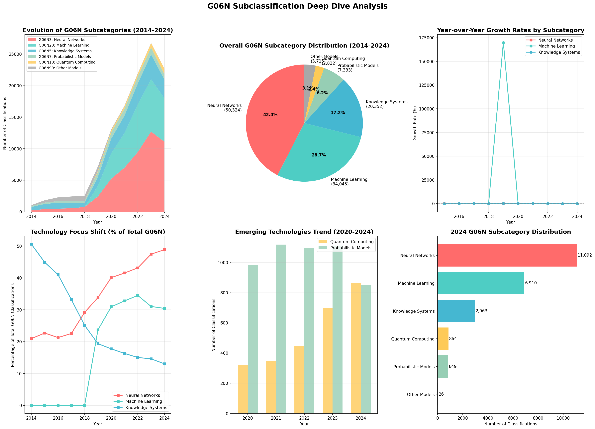

# G06Nサブ分類詳細分析レポート

## エグゼクティブサマリー

本レポートは、2014年から2024年のG06N特許サブ分類の詳細分析を提供し、AI特許内の技術的ニュアンスを明らかにします。118,602件のG06N分類を含む72,404件の特許分析により、ニューラルネットワーク（G06N3）が42.4%で優位を占め、機械学習（G06N20）が28.7%で続くことが判明しました。2024年には全主要サブカテゴリーが減少し、市場全体の統合を示唆しています。

---

## G06N IPCサブ分類構造

| コード | カテゴリー | 説明 | 重点分野 |
|--------|-----------|------|----------|
| **G06N3** | ニューラルネットワーク | 生物学的モデルベースコンピューティング | 深層学習、CNN、RNN、トランスフォーマー |
| **G06N5** | 知識システム | エキスパートシステムと論理ベースAI | ルールエンジン、オントロジー、推論 |
| **G06N7** | 確率モデル | 不確実性処理システム | ベイジアンネットワーク、ファジー論理 |
| **G06N10** | 量子コンピューティング | 量子計算モデル | 量子アルゴリズム、量子ビット |
| **G06N20** | 機械学習 | 一般的なMLアルゴリズム | 教師あり、教師なし、強化学習 |
| **G06N99** | その他のモデル | 代替計算パラダイム | ハイブリッドシステム、新規アプローチ |

---

## 主要調査結果

### 全体分布（2014-2024年）

| サブカテゴリー | 分類数 | 割合 | 使用特許数 |
|---------------|--------|------|------------|
| **G06N3 - ニューラルネットワーク** | 50,324 | 42.4% | 約35,000 |
| **G06N20 - 機械学習** | 34,045 | 28.7% | 約28,000 |
| **G06N5 - 知識システム** | 20,352 | 17.2% | 約16,000 |
| **G06N7 - 確率モデル** | 7,333 | 6.2% | 約6,500 |
| **G06N99 - その他のモデル** | 3,715 | 3.1% | 約3,500 |
| **G06N10 - 量子コンピューティング** | 2,832 | 2.4% | 約2,500 |

### 上位詳細分類

| 分類 | 説明 | 件数 | 全体比率 |
|------|------|------|----------|
| **G06N20/00** | 機械学習（一般） | 30,361 | 25.60% |
| **G06N3/08** | ニューラルネットワークの学習方法 | 19,660 | 16.58% |
| **G06N3/04** | ニューラルネットワークアーキテクチャ/構造 | 13,277 | 11.19% |
| **G06N5/04** | 知識システムの推論方法 | 9,915 | 8.36% |
| **G06N5/02** | 知識表現 | 6,264 | 5.28% |
| **G06N7/00** | 確率モデル（一般） | 5,163 | 4.35% |
| **G06N3/063** | ニューラルネットワークの物理的実現 | 3,219 | 2.71% |
| **G06N3/045** | ニューラルネットワークの組み合わせ | 2,596 | 2.19% |
| **G06N10/00** | 量子コンピューティング（一般） | 2,193 | 1.85% |
| **G06N20/20** | MLにおけるカーネル法 | 2,182 | 1.84% |

---

## 時系列分析とトレンド

### 年次推移（2020-2024年）

#### ニューラルネットワーク（G06N3）
- 2020年: 5,230件
- 2021年: 6,982件（+33.5%）
- 2022年: 9,472件（+35.7%）
- 2023年: 12,709件（+34.2%）
- 2024年: 11,092件（-12.7%）⬇️

#### 機械学習（G06N20）
- 2020年: 4,036件
- 2021年: 5,512件（+36.6%）
- 2022年: 7,572件（+37.4%）
- 2023年: 8,315件（+9.8%）
- 2024年: 6,910件（-16.9%）⬇️

#### 知識システム（G06N5）
- 2020年: 2,316件
- 2021年: 2,741件（+18.4%）
- 2022年: 3,300件（+20.4%）
- 2023年: 3,911件（+18.5%）
- 2024年: 2,963件（-24.2%）⬇️

### 技術フォーカスの変遷

| 期間 | 主要技術 | 主な観察 |
|------|----------|----------|
| **2014-2016年** | 知識システム（G06N5） | 従来型AIが初期を支配 |
| **2017-2019年** | 移行期 | ニューラルネットワークが勢いを増す |
| **2020-2023年** | ニューラルネットワーク（G06N3） | 深層学習の爆発的成長、40%以上のシェア |
| **2024年** | 市場統合 | 全カテゴリー減少、質への焦点 |

---

## 技術詳細分析

### 1. ニューラルネットワーク（G06N3）- 42.4%シェア

**主要サブ分類:**
- **G06N3/08**: 学習方法（バックプロパゲーション、勾配降下法）
- **G06N3/04**: アーキテクチャ（CNN、RNN、トランスフォーマー）
- **G06N3/063**: ハードウェア実装
- **G06N3/045**: アンサンブルおよびハイブリッドネットワーク

**特許重点分野:**
- コンピュータビジョン応用
- 自然言語処理
- 自律システム
- 医療診断

### 2. 機械学習（G06N20）- 28.7%シェア

**主要サブ分類:**
- **G06N20/00**: 一般的なMLアルゴリズム
- **G06N20/10**: アンサンブル学習（ランダムフォレスト、ブースティング）
- **G06N20/20**: カーネル法（SVM、ガウス過程）

**特許重点分野:**
- 予測分析
- レコメンデーションシステム
- 不正検出
- 産業最適化

### 3. 知識システム（G06N5）- 17.2%シェア

**主要サブ分類:**
- **G06N5/04**: 推論エンジン
- **G06N5/02**: 知識表現
- **G06N5/022**: オントロジーと意味ネットワーク

**特許重点分野:**
- エキスパートシステム
- 意思決定支援
- 規制コンプライアンス
- ナレッジグラフ

### 4. 新興技術

#### 量子コンピューティング（G06N10）- 2.4%シェア
- 小さなシェアながら着実な成長
- 量子アルゴリズムとエラー訂正に焦点
- 主要プレーヤー：IBM、Google、Microsoft

#### 確率モデル（G06N7）- 6.2%シェア
- 不確実性定量化のためのベイジアンネットワーク
- 制御システムのためのファジー論理
- リスク評価への応用

---

## 市場インサイト

### 2024年の市場シグナル

1. **全カテゴリーでの広範な減少**
   - ニューラルネットワーク：-12.7%
   - 機械学習：-16.9%
   - 知識システム：-24.2%
   - 市場全体の統合を示す

2. **技術の成熟**
   - 量から質への転換
   - 実用的な実装に焦点
   - イノベーションより統合

3. **持続的階層**
   - ニューラルネットワークが優位を維持
   - 従来型AI（知識システム）も依然として関連性あり
   - 量子コンピューティングはまだ初期段階（2.4%）

### イノベーションパターン

| 技術 | イノベーション段階 | 市場ポジション |
|------|-------------------|----------------|
| ニューラルネットワーク | 成熟/最適化 | 支配的（42.4%） |
| 機械学習 | 成熟 | 強力（28.7%） |
| 知識システム | 安定/レガシー | 重要（17.2%） |
| 確率モデル | ニッチ応用 | 特化（6.2%） |
| 量子コンピューティング | 初期/実験的 | 新興（2.4%） |

---

## 戦略的含意

### 研究開発向け
1. **ニューラルネットワーク**が主要投資分野として継続
2. G06N3 + G06N20を組み合わせた**ハイブリッドアプローチ**の増加
3. **量子コンピューティング**が長期的機会を提示

### 特許戦略向け
1. 混雑したG06N3/G06N20領域での**差別化**が必要
2. G06N7（確率）とG06N10（量子）に**ニッチ機会**
3. 複数のサブカテゴリーを組み合わせた**統合特許**が価値あり

### 技術収束トレンド
- **G06N3 + G06N20**: 深層学習と古典的ML
- **G06N5 + G06N20**: 知識強化機械学習
- **G06N10 + G06N3**: 量子-古典ハイブリッドアルゴリズム

---

## 結論

1. **ニューラルネットワークの優位性**: G06N3が全G06N分類の42.4%を占め、AIイノベーションにおける深層学習の中心的役割を確認

2. **市場の成熟**: 2024年の全サブカテゴリーでの減少（-12%から-24%）は、爆発的成長から統合段階への移行を示す

3. **技術の階層化**: ニューラルネットワークとMLが頂点、従来型AIは安定、量子コンピューティングが新興という明確な階層が確立

4. **イノベーションの焦点**: 純粋なアルゴリズム開発から実用的応用とシステム統合への転換

5. **将来の方向性**: 複数のG06Nサブカテゴリーを組み合わせたハイブリッドシステムが次のイノベーションの波を代表

---

## 推奨事項

### 即時アクション
1. **ポートフォリオ分析**: G06Nサブカテゴリー全体での特許保有状況を評価
2. **ギャップ特定**: G06N7とG06N10の過小評価領域を発見
3. **統合機会**: クロスサブカテゴリーイノベーションを探索

### 戦略的計画
1. **ニューラルネットワーク重視**: 強力なG06N3プレゼンスを維持しつつ差別化を追求
2. **量子準備**: 将来の優位性のためG06N10能力を構築
3. **ハイブリッドシステム**: 複数のサブカテゴリーを組み合わせた特許を開発

### 研究優先事項
1. **G06N3/045**: ニューラルネットワークの組み合わせとアンサンブル
2. **G06N20/10**: 高度なアンサンブル学習方法
3. **G06N10**: 量子-古典ハイブリッドアルゴリズム

---

*分析日: 2024年11月*  
*データ期間: 2014-2024年*  
*分析対象特許総数: 72,404件*  
*総分類数: 118,602件*

---

*サブ分類レポート終了*